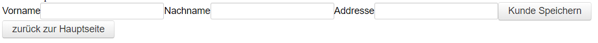
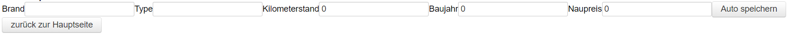
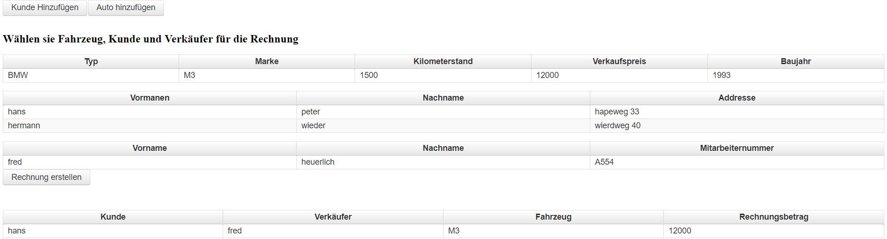

# usedCarShop
microprojekt für NVS

###AKTUELLES PROJEKT BEFINDET SICH IM ORDNER "AKTUELLE VERSION"

Es können Autos und kunden in Datenbank gespeichert werden.

Der verkaufspreis des Autos berechnet sich automatisch aus den eingegeben Parametern (fiktive berechnung). Diese berechnung findet über die gefahrenen Kilometer, den Neupreis und das Baujahr .

Die Hauptseite bietet eine Übersicht über alle rechnungsrelevanten Daten. Durch auswählen in den Listen der einzelnen Kunden Verkäufer und einem KFZ kann über den Button eine Rechnung erstellt werden.(Rechnung erstellen buggy !!BUTTON MEHRMALS DRÜCKEN!!)

Projekt ausführen:

zuerst Datenbank in "db" ordner starten. 
danach vorkonfigurierten wildfly starten.